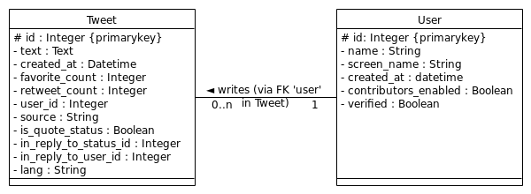

#  Semiotweet
Tweets analysis from politics.

## What's the goal

_Semiotweet_ aims to better understand the tweets posted by politics.
It shows what are the most commons words in those tweets, and what are the different semantic fields related to them.


## How it works
Stack is subjects to know changes.

### Stack :
 - Django as framework,
 - PostGreSQL for the database,
 - Twitter API as data provider,
 - TreeTagger for tweets' analysis,
 - chart.js for visualization

## Architecture, data structures & models

There's just one app called `viewer` yet. `urls.py` directly redirects to this app.
`extraction.py` and `semanticAnalysis.py` contains functions that are used in the views.

The one from `extraction.py` catch the tweets, those in `semanticAnalysis.py` process the analysis.

## UML TO BE UPDATED !

There are only two models : `Tweet` and `User` :


Those models may change with new features.

Templates are directly put in `viewer/templates/` and not as usual in `viewer/templates/viewer` as it can be the case in most of Django apps.

## How to install

### Virtual environment

Clone it. Go to the folder and :

```
# For Python 3.6 or Python 3.x
$ virtualenv -p /usr/bin/python3 venv3
$ source venv3/bin/activate

# For Python 2.7
$ virtualenv venv
$ source venv/bin/activate
```

#### In the following, all the `export` lines can be put at the end of the file /venv3/bin/activate`. It is easier to define the env variables that way since those lines are executed when lauching the venv.

You have to set some variables in yout virtual env.
First the "secret key" for the app (needed by Django). You can use [this site](http://www.miniwebtool.com/django-secret-key-generator) to generate one.
```
$ export SECRET_KEY='someLongStringToImagine'
```

### TreeTagger

_TreeTagger_ is one of the main library used for the project. You have to install it with the french parameter file in your home directory by refering to the official docummentation (see [here](http://www.cis.uni-muenchen.de/~schmid/tools/TreeTagger/))

You have to specify the folder in which you install _TreeTagger_ with the `LOCALTAGDIR` variable :
```
$ export LOCALTAGDIR='/path/to/tree-tagger/'
```

### Credentials for Twitter API
Then the credentials (for user and consumer)for your app in order to use Twitter API.
In order to have those string, you need to create a Twitter App (see [here](https://apps.twitter.com/app/13440041/show)) ; then you can copy-paste them to set them in your virtual env.
```
$ export CONSUMER_KEY='someLongStringToImagine'
$ export CONSUMER_SECRET='someLongStringToImagine'
$ export KEY='someLongStringToImagine'
$ export SECRET='someLongStringToImagine'
```

### Requirements
Then install the requirements
```
$ pip install -r requirements.txt
```
If you have the error `pg_config not found` just install the `libpq_dev` package.
If you have the error `could not run curl-config` install the `libcurl4-openssl-dev` package.
Then re-install the requirements


You have to create a `local_settings.py` in the same folder as `setting.py` in order to extend this file (see the end of `setting.py`) ; this is useful for managing different
data base between local development and deployement :
```
$ touch local_settings.py
```
In this file are the settings set to use the local database (`DEBUG` is set to True for dev', false for production.) :

```
# Local settings : used for local development.
from __future__ import absolute_import
from .settings import PROJECT_ROOT, BASE_DIR
import os

DEBUG = True

DATABASES = {
    'default': {
        'ENGINE': 'django.db.backends.sqlite3',
        'NAME': os.path.join(BASE_DIR, 'db.sqlite3'),
    }
}

```
Then you have to run this in order to set up the models and the database :
```
$ python manage.py makemigrations
$ python manage.py makemigrations viewer
$ python manage.py migrate
```
Finally, `$ python manage.py runserver` runs the server locally.

## Getting users data and tweets

Once the server is running, you can extact the data concerning the users and their tweets by clicking on `Update Data` or by getting to `http://127.0.0.1:8000/getData/`

## Project Progress

| Things done                                                         | Things to do                  |
| -------------                                                       | -------------                 |
| Connection to Twitter API (100%)                                    |  Semantic fields (80%)        |
| Basic architecture (100%)                                           | JS libraries (90 %)           |
| Defining models (100%)                                              |                               |
| Defining Env' Variables (100%)                                      | README.md (60%)               |
| Extracting user info (100%)                                         ||
| Extracting old tweets (100%)                                        ||
| Extracting latest tweets (100%)                                     ||
| Modular code for extraction (100%)                                  ||
| Getting all the users at once (100%)                                ||
| Extract new tweet (100%)                                            || |
| Deployement on Heroku (100%)                                        || |


## Usefull Ressources

  - Logo from [graphicdesignblg](https://www.instagram.com/graphicdesignblg/ "graphicdesignblg on Instagram")
  - [Twitter API documentation](https://dev.twitter.com/ "Twitter API documentation")
  - [Map of a Twitter Status Object](http://www.slaw.ca/wp-content/uploads/2011/11/map-of-a-tweet-copy.pdf "Map of a Twitter Status"), Raffi Krikorian
  - Marco Bonzanini, [Mining Twitter Data with Python](https://marcobonzanini.com/2015/03/02/mining-twitter-data-with-python-part-1/ "Mining Twitter Data with Python")
  - [Migrating Your Django Project to Heroku](https://realpython.com/blog/python/migrating-your-django-project-to-heroku/ "Migrating Your Django Project to Heroku")
  - [TreeTagger](http://www.cis.uni-muenchen.de/~schmid/tools/TreeTagger/) for the tagging, tokenization and lemmatization of french documents

## License
  This project is under [GNU General Public License (Version 3, 29 June 2007)](https://github.com/jjerphan/semiotweet/blob/master/LICENSE).
  Feel free to contact us and to fork or to patch this project.
